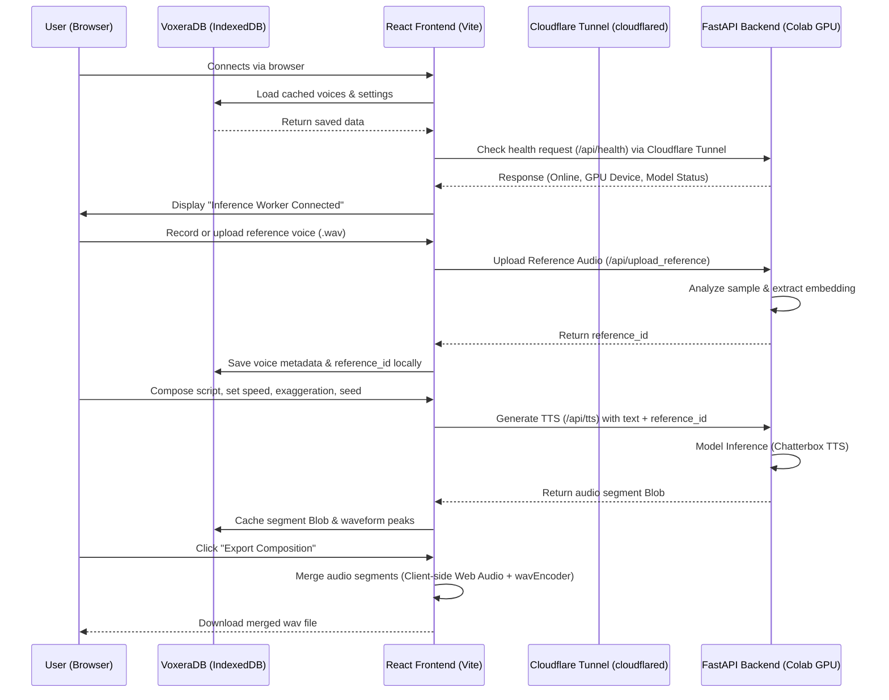

# 🎙️ Voxera: AI Voice Generation & Voice Cloning Studio

Voxera is a premium, high-fidelity AI voice generation and voice cloning studio. It provides an intuitive script editor, multi-voice timeline composition, custom voice cloning library, advanced generation parameters, and client-side audio assembly.

The application leverages a local **IndexedDB** database for server-independent data persistence, communicates with a high-performance **FastAPI Inference Server** running **Chatterbox TTS** and **DeepFilterNet/RNNoise** (deployable on a Google Colab GPU), and provides visual waveforms using **Wavesurfer.js**.

---

## 🏗️ System Architecture

Voxera splits computational complexity from interface fluidity by utilizing a client-server architecture with public tunnels:



---

## ✨ Core Features

*   🎞️ **Timeline Audio Composition**: Write/edit long scripts, partition them into distinct blocks, rearrange them, and assign unique system or custom voices to individual segments.
*   🧬 **High-Fidelity Voice Cloning**: Clone any voice by uploading a 5-15 second reference WAV or MP3 audio file. Custom voices are categorized and tagged.
*   🎛️ **Advanced Model Parameters**: Fine-tune speech synthesis with control over Temperature, CFG weight, repetition penalty, seed value, language, and model presets.
*   💾 **VoxeraDB (Local Storage)**: Seamlessly persist project scripts, generated audio segments, cloned voices, and generation history in the browser using IndexedDB. No audio data is stored on remote servers.
*   🧩 **Client-Side WAV Assembly**: Instant, browser-based audio rendering that stitches separate generated segments together into a single high-quality WAV composition file.
*   🧹 **Audio Denoising & Enhancement**: Send noisy audio reference clips or voice samples to the backend to clean them up using DeepFilterNet and RNNoise.
*   📈 **Waveform Visualizer**: Inspect audio waveforms using dynamic **Wavesurfer.js** tracks with zoom, playback controls, and speed adjusters.
*   🌓 **Responsive Theme Styling**: Built with Tailwind CSS v4 supporting dark and light theme modes.

---

## 🛠️ Getting Started

### 1. Frontend Setup (React & Vite)

#### Prerequisites
*   [Node.js](https://nodejs.org/) (v18.0.0 or higher)
*   npm (v9.0.0 or higher)

#### Installation
Clone the repository and install all dependencies:
```bash
# Navigate to the frontend workspace
cd voice_clone/frontend

# Install dependencies
npm install
```

#### Run Local Development Server
Start Vite's development server on your machine:
```bash
npm run dev
```
Open [http://localhost:3000](http://localhost:3000) in your web browser.

---

### 2. Backend Setup (Inference Server)

The voice cloning backend runs a FastAPI app serving Resemble AI's **Chatterbox** TTS engine. Due to high GPU memory requirements for inference, it is designed to run on a GPU-enabled environment like Google Colab.

#### Running on Google Colab / Jupyter
1.  Open the Jupyter notebook [VOXERA_backend.ipynb](VOXERA_backend.ipynb) in Google Colab.
2.  Switch the Colab runtime to a GPU:
    *   Go to **Runtime** > **Change runtime type**
    *   Select **T4 GPU** (or higher) and click **Save**.
3.  Run all cells in the notebook. This will:
    *   Verify CUDA GPU availability.
    *   Build `rnnoise` from source.
    *   Install PyTorch, `chatterbox-tts`, `fastapi`, and other dependencies.
    *   Download the pre-trained Chatterbox synthesis models.
    *   Launch the FastAPI application server.
    *   Start a background **Cloudflare Tunnel (`cloudflared`)** to expose your Colab backend securely.

#### Connect Frontend to Backend
1.  Locate the printed URL ending in `.trycloudflare.com` in the final cells of the Colab notebook.
2.  Open your local Voxera frontend, click the **Settings** or **Inference Worker** link on the Sidebar.
3.  Paste the Cloudflare URL into the connection modal and click **Connect**.
4.  The indicator will turn green once health check succeeds, showing latency and GPU hardware details.

---

## 📂 Project Structure

```
frontend/
├── VOXERA_backend.ipynb        # Colab backend setup and server deployment script
├── index.html                  # HTML entrypoint
├── package.json                # Project dependencies and run scripts
├── tsconfig.json               # TypeScript configuration
├── vite.config.ts              # Vite server & bundler configuration
└── src/
    ├── App.tsx                 # Base App entrypoint
    ├── main.tsx                # React virtual DOM mounter
    ├── index.css               # Global styling, themes (light/dark), scrollbars
    ├── types.ts                # App interfaces (Voice, AudioSegment, HistoryItem)
    ├── components/             # React UI components
    │   ├── AppShell.tsx        # Navigation coordinator and state orchestration
    │   ├── Sidebar.tsx         # Sidebar navigation links & connection status
    │   ├── TopBar.tsx          # Application header and user options
    │   ├── Toast.tsx           # Success, error, and loading notifications
    │   ├── ConfirmDialog.tsx   # Deletion / action confirmation popups
    │   ├── studio/             # Audio Composition Studio components
    │   │   ├── StudioPage.tsx       # Main dashboard layout
    │   │   ├── ScriptEditor.tsx     # Rich text area for writing segment text
    │   │   ├── VoicePanel.tsx       # Controls for active voice & advanced setting dials
    │   │   ├── VoicePickerModal.tsx # Panel containing available system/custom voices
    │   │   ├── AudioComposition.tsx # Timeline visualization, waveform editing & splitters
    │   │   ├── AudioPlayerBar.tsx   # Playback controller for timeline tracks
    │   │   └── RenameProjectModal.tsx # Project renaming modal
    │   ├── voices/             # Voice Library components
    │   │   ├── VoiceLibrary.tsx     # Grid viewing and deleting custom/system voices
    │   │   └── CreateVoicePage.tsx  # Form to record/upload samples to clone a voice
    │   ├── history/            # History Page components
    │   │   └── HistoryPage.tsx      # Table list of past compositions with favorite filters
    │   └── settings/           # Configuration settings
    │       ├── SettingsPage.tsx     # Storage clearers and developer preferences
    │       └── ConnectionModal.tsx  # API URL pasting & latency checks
    ├── data/
    │   └── mockData.ts         # Initial system voices and audio snippets
    └── utils/
        ├── api.ts              # FastAPI fetch endpoints (health, upload, tts, denoise)
        ├── audioEngine.ts       # HTML5 Audio context controller
        ├── db.ts               # Local IndexedDB database manager (VoxeraDB)
        └── wavEncoder.ts       # Client-side WAV concatenation utility
```

---

## 📡 API Endpoints (Inference Worker)

If you are writing custom client integrations, the FastAPI backend exposes these endpoints:

| Endpoint | Method | Form Data / Query Parameters | Description |
| :--- | :--- | :--- | :--- |
| `/api/health` | `GET` | None | Returns backend status, hardware device, and model loading state. |
| `/api/upload_reference` | `POST` | `audio_prompt` (file) | Uploads reference audio file and returns a unique `reference_id` to cache. |
| `/api/tts` | `POST` | `text`, `exaggeration`, `cfg_weight`, `temperature`, `seed`, `language`, `model`, `reference_id` (optional), `audio_prompt` (optional file) | Generates and returns a synthesized speech WAV audio file. |
| `/api/denoise` | `POST` | `audio` (file) | Accepts a noisy WAV/MP3 file and returns a denoised WAV output. |

---

## 📄 License

This project is licensed under the MIT License.
